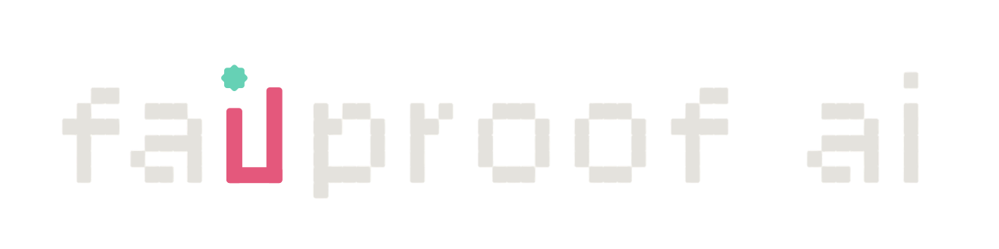

<p align="center">
  
</p>

<p align="center">
  The FailproofAI org's collection of <strong>agent skills</strong> - reusable, cross-agent
  instruction sets that teach a coding agent how to do a specific job well.<br/>
  One repo, many skills, installable with <a href="https://skills.sh"><code>npx skills</code></a>.
</p>

## What's an agent skill?

A skill is a folder with a `SKILL.md` (YAML frontmatter: `name` + `description`,
then instructions). Agents load it when a task matches the description, so the
agent gains a specialized, repeatable capability without you re-explaining it.
The format is shared across agents, so one definition works everywhere.

## Skills in this collection

| Skill | What it does | Source of truth |
|---|---|---|
| [`failproofai`](skills/failproofai/) | **Start here.** The way into the product - what FailproofAI is, setting a machine up from zero (local-only or cloud-connected), the `failproofaid` daemon, moving history in with backfill/flush/capture paths, installing hooks and policies across 12 agent CLIs, local vs cloud audits, fleet and org operations, upgrade/uninstall, and troubleshooting by symptom. Routes to the specialist skills below when one owns the job, and stands alone when they aren't installed. | Maintained here. Not synced from anywhere - edit in this repo. |
| [`failproofai-complete`](skills/failproofai-complete/) | The whole product in **one** artifact - both binaries (`failproofai` local, `fp` cloud), all five verticals, every command of both CLIs, the env-var and never-rename tables, the docs map, and which sibling skill owns what. The *knowing* skill to `failproofai`'s *doing*: hand it to an agent that has to explain the product, or stand a machine up with no sibling installed. | Maintained here. Not synced from anywhere - edit in this repo. |
| [`failproofai-policy-author`](skills/failproofai-policy-author/) | Turn what agents keep doing wrong into enforcement for [failproofai](https://github.com/FailproofAI/failproofai) - triage a `failproofai audit` or FailproofAI Cloud findings, convert a CLAUDE.md/AGENTS.md into policies, or take a plain complaint ("agents keep force-pushing") and enforce it. Checks the shipped builtins and their params before writing anything, since most requests are one line of config; knows which of the 12 supported agent CLIs actually enforce a given event, so it never ships a deny the harness discards; tests every policy it authors. | Maintained here. Not synced from anywhere - edit in this repo. |
| [`failproofai-policy-deploy`](skills/failproofai-policy-deploy/) | Get a written policy off one machine and onto the machines that need it - prove it locally with `fp policies test` (no server, no auth), publish a version, `fp fleet deploy` in observe, read `fp guardrails`, then promote or roll back. Leads with the two traps that make a rollout look finished when it isn't: publishing deploys nothing, and a bare `--add` **enforces**. Also covers the single-machine local lane - scopes, the `*-policies.mjs` filename convention, packs. | Maintained here. Not synced from anywhere - edit in this repo. |
| [`fp-cloud-cli`](skills/agenteye-cli/) | Operate a FailproofAI Cloud deployment from the terminal via the `fp` CLI - inspect telemetry (errors, sessions, events, evals, usage), triage alerts and issues, manage keys/users/orgs/settings, run saved queries. Global options go **before** the command: `fp --json sessions`, not `fp sessions --json`. | Synced from `FailproofAI/failproofai` → `fp-cloud-cli/skill/`. Do **not** hand-edit here. |
| [`failproofai-sdk`](skills/agenteye-python-sdk/) | Make an AI agent report what it did - plan which points in the agent loop to record, write the instrumentation with the `failproofai_sdk` Python module, thread session/agent identity through it, and verify the events actually land. For an agent loop that is **not** one of the 12 supported CLIs. | Synced from `FailproofAI/failproofai` → `sdk/python/skill/`. Do **not** hand-edit here. |
| [`agenteye-evaluator`](skills/agenteye-evaluator/) | Put automatic quality scores on an agent's production runs - decide which dimensions are worth scoring from real sessions, scaffold the scoring service with the `agenteye-evaluator` Python SDK, score with rules or an LLM judge, test it against a captured session, deploy it and confirm scores land. | Synced from `FailproofAI/agenteye` → `evaluator-sdk/skill/` (private). Do **not** hand-edit here. |

### Renamed with the product: read this before `npx skills update`

Two of the three mirrors were renamed upstream when AgentEye became FailproofAI Cloud. **In
this checkout they still sit under their old folder names** - the renamed mirrors have not
landed yet, so the folders below are what exists on disk today and what the links above point
at. The left column is the skill name each is shipping under.

| Skill name | Folder here today | Was |
|---|---|---|
| `fp-cloud-cli` | `skills/agenteye-cli/` | `agenteye-cli` |
| `failproofai-sdk` | `skills/agenteye-python-sdk/` | `agenteye-python-sdk` |
| `agenteye-evaluator` | `skills/agenteye-evaluator/` | **not renamed** - this is its real, current name upstream. Don't "fix" it |

If `npx skills update agenteye-cli` (or `agenteye-python-sdk`) stops resolving, that is the
rename landing, not a broken install: remove the old name and add the new one.

```bash
npx skills remove agenteye-cli
npx skills add FailproofAI/skills --skill fp-cloud-cli -a claude-code
```

Until then the old names are what `--skill` accepts, which is why the examples below use
`failproofai` - a name that is valid on both sides of the rename.

## Install

Using the [`skills`](https://skills.sh) CLI (`vercel-labs/skills`). It auto-detects
your agent(s); pass `-a` to be explicit.

```bash
# the whole collection (project-local → ./.agents/skills/)
npx skills add FailproofAI/skills

# just one skill
npx skills add FailproofAI/skills --skill skillname

# explicitly for claude-code
npx skills add FailproofAI/skills -a claude-code

# just ONE skill - use the --skill flag (NOT a /failproofai path segment)
npx skills add FailproofAI/skills --skill failproofai -a claude-code

# global (all projects → ~/.claude/skills/), with real copies instead of symlinks
npx skills add FailproofAI/skills --skill failproofai -a claude-code -g --copy

# Codex instead
npx skills add FailproofAI/skills --skill failproofai -a codex
```

Or point straight at the skill folder by URL:
`npx skills add https://github.com/FailproofAI/skills/tree/main/skills/failproofai -a claude-code`

Pass the name **as it exists in the repo right now** - `--skill` and a URL path segment both
resolve against the folder, so the two renamed mirrors still answer to `agenteye-cli` and
`agenteye-python-sdk` here. `npx skills add FailproofAI/skills --list` is the authoritative
list; see [Renamed with the product](#renamed-with-the-product-read-this-before-npx-skills-update).

Inspect / verify / manage:
```bash
npx skills add FailproofAI/skills --list   # list skills in the repo (no install)
npx skills list -a claude-code             # what's installed (alias: ls)
npx skills update failproofai              # update an installed skill
npx skills remove failproofai              # remove it
```

### Scope & install method
| Scope | Flag | Where it lands (Claude Code) |
|---|---|---|
| Project (default) | _(none)_ | `./.claude/skills/` - commit with your project |
| Global | `-g` | `~/.claude/skills/` - across all projects |

By default the CLI **symlinks** each agent's skills dir to one canonical copy
(easy updates). If your environment doesn't follow symlinks, add **`--copy`** for
independent real copies.

> **Public-repo note:** for anyone outside the org to `npx skills add
> FailproofAI/skills`, this repo must be **public**. If it stays private, installs
> need auth or an internal mirror. (All synced skills' content is scrubbed
> safe-for-public — that is a standing requirement of the sync, not a one-off.)

### Troubleshooting - "installed, but my agent doesn't see it"
- **Claude Code reads `.claude/skills/` (project) / `~/.claude/skills/` (global) - *not* `.agents/skills/`.** `.agents/skills/` is the vendor-neutral path other agents use (Codex project, Cursor, Gemini CLI, …) and where the symlink **canonical store** lives. If the skill only shows up under `~/.agents/skills/` and Claude Code ignores it, the per-agent symlink wasn't created or wasn't followed.
- **Fix:** re-install targeting the agent explicitly and forcing real copies:
  `npx skills add FailproofAI/skills --skill failproofai -a claude-code -g --copy`
- **Verify with the CLI, not by eyeballing dirs:** `npx skills list -a claude-code`.
- **Codex paths:** project `.agents/skills/`, global `~/.codex/skills/`.

## Layout

```
skills/                         ← this repo
├── README.md
├── LICENSE
├── CONTRIBUTING.md             ← conventions + how to add a skill
├── assets/                     ← banner for this README
├── templates/SKILL.template.md ← starter for a new skill (or use `npx skills init`)
├── scripts/validate-skills.py  ← frontmatter/layout validator (run before merge)
└── skills/                     ← one self-contained folder per skill
    ├── failproofai/             ← the umbrella: start here
    │   ├── SKILL.md
    │   ├── references/          ← concepts · setup · transfer · daemon · policies
    │   │                           harnesses · audits · sessions · cloud · cli
    │   │                           troubleshooting
    │   └── agents/openai.yaml
    ├── failproofai-complete/    ← the whole product, one artifact
    │   ├── SKILL.md
    │   ├── references/          ← commands · verticals · setup · directory
    │   │                           env-vars · literals · glossary
    │   └── agents/openai.yaml
    ├── failproofai-policy-author/
    │   ├── SKILL.md
    │   ├── references/          ← api · builtins · cloud · harnesses · patterns
    │   │                           rules-files · traps
    │   ├── scripts/             ← runnable helpers (test a policy, sync a reference)
    │   └── agents/openai.yaml
    ├── failproofai-policy-deploy/
    │   ├── SKILL.md
    │   ├── references/          ← cloud-lane · local-lane · packs
    │   └── agents/openai.yaml
    ├── agenteye-cli/            ← mirror · ships as `fp-cloud-cli`
    │   ├── SKILL.md
    │   ├── references/commands.md
    │   └── agents/openai.yaml
    ├── agenteye-python-sdk/     ← mirror · ships as `failproofai-sdk`
    │   ├── SKILL.md
    │   ├── references/          ← events · install · integration
    │   └── agents/openai.yaml
    └── agenteye-evaluator/      ← mirror · name unchanged upstream
        ├── SKILL.md
        ├── references/          ← brainstorm · scaffold · sdk-api · session-data
        └── agents/openai.yaml
```

Each skill folder is **self-contained**: its references/scripts/assets live inside
`skills/<name>/` and use relative paths, because the installer copies the whole
folder and nothing outside it. See **[CONTRIBUTING.md](CONTRIBUTING.md)** to add
or update a skill.

## Telemetry & license

`npx skills` sends anonymous usage telemetry (and transmits skill files for a
public repo); disable with `DISABLE_TELEMETRY=1` or `DO_NOT_TRACK=1` (auto-off in CI).

License: see [`LICENSE`](LICENSE) - _placeholder; to be finalized before public release._
